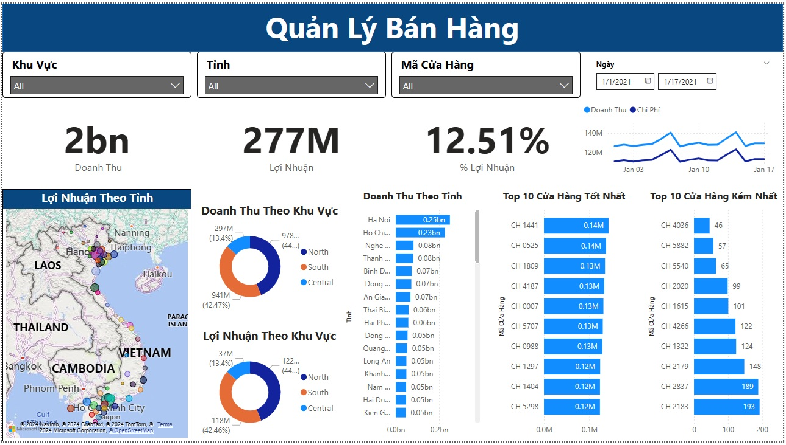

# Project: Sales Management - January
## Introduction
This project provides a sales management system with data collected in January, covering detailed information about nearly 6,000 stores nationwide across 63 provinces in Vietnam.
## Objectives
- Analyze sales data to support business decision-making.
- Efficiently manage store information for easy access.
- Generate reports based on provinces, cities, and regions.
## Key Features
1. Store Information Management:
- Includes name, address, store ID, and region.
2. Revenue Tracking:
- Monthly revenue overview for each store.
3. Data Analysis by Province:
- Detailed sales reports for each area.

## Project Structure
```javascript 
📂 sales-management  
├── 📁 data               # Directory for January data  
├── 📄 README.md          # Project documentation  
└── 📄 Quản Lý Bán Hàng.pbix   # Required libraries  
```

## Usage Guide
Installation
```javascript 
git clone https://github.com/mtateeminhvu/PowerBI-QuanLyBanHang.git  

```

## Demo
### Overview

<p align="center">
  
</p>

## Contact
Email: minhvvhcm@gmail.com
Tel: +84 300 040 919
If you find this project helpful, don’t forget to star this repository! 🌟